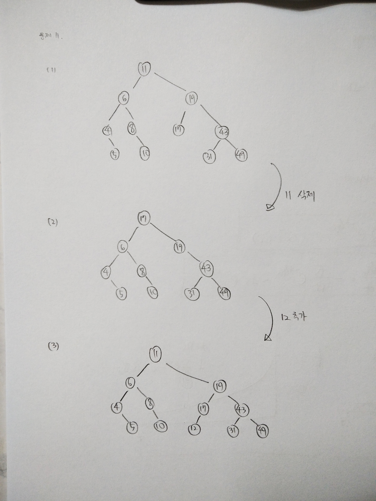

# Chapter 8. Tree

-------

01.

(4) D B A E C F


02.

(2) E


03.

(4) A B / C * D * E + 


04.

4개


05.

3개


06.

(3) + * A B / C D 


07.

(4) 31


08.

(3) 스레드 이진 트리(threaded binary tree) 

이진 트리의 NULL 링크를 활용하자는 것이 스레드 이진 트리의 목적


09.

| 알고리즘 | 평균의 시간복잡도 | 최악의 시간복잡도 |
| -------- | ----------------- | ----------------- |
| 탐색     | O(log n)          | O(n)              |
| 삽입     | O(log n)          | O(n)              |


10.

(1)

| 인덱스 | 0    | 1    | 2    | 3    | 4    | 5    | 6    | 7    | 8    | 9    | 10   | 11   | 12   | 13   | 14   | 15   |
| ------ | ---- | ---- | ---- | ---- | ---- | ---- | ---- | ---- | ---- | ---- | ---- | ---- | ---- | ---- | ---- | ---- |
| 값     |      | 6    | 4    | 9    | 2    | 5    | 7    | 10   | 1    | 3    |      |      |      |      | 8    | 11   |

(2)

6-4-2-1-3-5-9-7-10-8-11 

(3)

1-3-2-5-4-7-8-11-10-9-6 

(4)

1-2-3-4-5-6-7-9-8-10-11

(5) 

6-4-9-2-5-7-10-1-3-8-11 

(6) 아니다.

중위 순회를 하였을 때, 오름차순으로 정렬되어있어야 한다. (4)를 보면 그렇지 않다.


11.

(4)

11-6-8

(5)

| 인덱스 | 0    | 1    | 2    | 3    | 4    | 5    | 6    | 7    | 8    | 9    | 10   | 11   | 12   | 13   | 14   | 15   |
| ------ | ---- | ---- | ---- | ---- | ---- | ---- | ---- | ---- | ---- | ---- | ---- | ---- | ---- | ---- | ---- | ---- |
| 값     |      | 11   | 6    | 19   | 4    | 8    | 17   | 43   |      | 5    |      | 10   |      |      | 31   | 49   |


12.

8을 반환한다.

```c
if (node가 NULL 값을 가지면){
    return 0;
}
else if (자식이 없다면){
    return node->data
}
else (자식이 있다면){
    return max(왼쪽 자식, 오른쪽 자식)
}
```


13.

- Tree.h

```c
#include <stdio.h>
#include <stdlib.h>
#define max(a, b) (((a) > (b)) ? (a) : (b))

typedef struct TreeNode {
	int data;
	struct TreeNode* left, * right;
} TreeNode;

/* 트리의 형태
			 15(n6)
	 4(n2)             20(n5)
 1(n1)              16(n3)  25(n4)
*/

TreeNode n1 = { 1, NULL, NULL };
TreeNode n2 = { 4, &n1, NULL };
TreeNode n3 = { 16,NULL,NULL };
TreeNode n4 = { 25,NULL,NULL };
TreeNode n5 = { 20,&n3,&n4 };
TreeNode n6 = { 15,&n2,&n5 };
TreeNode* root = &n6;

void inorder(TreeNode* root)
{
	if (root != NULL)
	{
		inorder(root->left);
		printf("[%d] ", root->data);
		inorder(root->right);
	}
}
```

```c
# include "Tree.h"

int get_height(TreeNode* root)
{
	int height = 0;
	if (root != NULL)
		height = 1 + max(get_height(root->left), get_height(root->right));
	return height;
}
int isBalanced(TreeNode* root)
{	
	//노드에 아무것도 없으면 거짓을 반환
	if (root == NULL) return 0;
	
	int tmp = abs(get_height(root->left) - get_height(root->right));

	if (tmp <= 1)
		return 1; //만약 결과값의 절대값이 1이하이면 참을 반환
	else
		return 0; //그렇지 않으면 거짓을 반환
}

main()
{	
	printf("입력된 트리값(중위순회) :");
	inorder(root);
	if (isBalanced(root) == 1)
		printf("\n균형 트리입니다\n");
	else
		printf("\n균형 트리가 아닙니다\n");
}

```


14.

```c
#include "Tree.h"

void search_less_than_inputval(TreeNode* root, int val)
{
	if (root != NULL) {
		//입력값보다 저장된 값이 작으면 출력한다
		if (root->data < val)
			printf("%d보다 작은 노드 : %d\n", val, root->data);
		
		//현재 노드의 좌측 자식을 입력값과 비교한다
		search_less_than_inputval(root->left, val);
		//현재 노드의 우측 자식을 입력값과 비교한다
		search_less_than_inputval(root->right, val);
		
	}
}

main()
{
	printf("입력된 트리값(중위순회) :");
	inorder(root);
	printf("\n값을 입력하시오 : ");
	int scan;
	scanf("%d", &scan);
	search_less_than_inputval(root, scan);
}

```


15.

```c
#include "Tree.h"

void search_less_than_inputval(TreeNode* root, int val)
{
	if (root != NULL) {
		//입력값보다 저장된 값이 작으면 출력한다
		if (root->data < val)
			printf("%d보다 작은 노드 : %d\n", val, root->data);
		
		//현재 노드의 좌측 자식을 입력값과 비교한다
		search_less_than_inputval(root->left, val);
		//현재 노드의 우측 자식을 입력값과 비교한다
		search_less_than_inputval(root->right, val);
		
	}
}

main()
{
	printf("입력된 트리값(중위순회) :");
	inorder(root);
	printf("\n값을 입력하시오 : ");
	int scan;
	scanf("%d", &scan);
	search_less_than_inputval(root, scan);
}

```


16.

```c
#include "Tree.h"

int find_node_having_single(TreeNode* root)
{
	int temp = 0;
	if (root == NULL)
		return 0;
	//만약 노드가 없으면 0을 반환한다
	else
	{
		if ((root->left != NULL && root->right == NULL)
			|| (root->left == NULL && root->right != NULL))
			temp += 1;
		//만약 노드의 자식이 오른쪽만 있거나 왼쪽만 있으면 temp 값을 1 증가시킨다
	}

	return temp + find_node_having_single(root->left) + find_node_having_single(root->right);
}//재귀 함수를 이용한 방법으로 지속적으로 자식의 여부를 확인하고 조건에 맞으면 값을 1씩 증가시킨다

main()
{
	printf("입력된 트리값(중위순회) :");
	inorder(root);
	printf("\n자식 개수가 하나인 노드의 개수 : %d개", find_node_having_single(root));
}

```

17.

```c
#include "Tree.h"

int find_min(TreeNode* root)
{
	if (root == NULL) // 더이상 노드가 존재하지 않으면
		return 999999; //매우 큰 숫자 return

	else
	{
		int min_val = root->data; // 부모의 값을 저장
		if (min_val > find_min(root->left)) // 저장된 값과 좌측 자식과 비교 후
			min_val = find_min(root->left); // 자식이 더 작으면 그 값으로 갱신
		if (min_val > find_min(root->right)) 
			min_val = find_min(root->right); 
		return min_val; //저장된 값을 반환
	}
}

int find_max(TreeNode* root)
{
	if (root == NULL)
		return -999999;

	else
	{
		int max_val = root->data;
		if (max_val < find_max(root->left))
			max_val = find_max(root->left);
		if (max_val < find_max(root->right))
			max_val = find_max(root->right);
		return max_val;
	}
}
main()
{
	printf("최소값 : %d\n", find_min(root));
	printf("최대값 : %d\n", find_max(root));
}

```

18.

- BinarySearchTree.h

```c
#include "Tree.h"

TreeNode* new_node(int item)
{
	TreeNode* temp = (TreeNode*)malloc(sizeof(TreeNode));
	temp->data = item;
	temp->left = temp->right = NULL;
	return temp;
}

TreeNode* insert_node(TreeNode* node, int key)
{
	if (node == NULL) return new_node(key);
	if (key < node->data)
		node->left = insert_node(node->left, key);
	else if (key > node->data)
		node->right = insert_node(node->right, key);
	return node;
}
```

```c
#include "BinarySearchTree.h"

void sort(int arr[], int size)
{
	TreeNode* root = NULL;
	for (int i = 0; i < size; i++)
	{
		root = insert_node(root, arr[i]); // 이진 탐색 트리를 만든다
	}
	inorder(root); // 중위 순회하여 값을 읽어온다.
}

main()
{
	int arr[11] = { 11,3,4,1,56,5,6,2,98,32,23 };
	printf("현재 입력된 배열 : ");
	int size = sizeof(arr) / sizeof(int); // 배열의 크기를 size 변수에 저장
	for (int i = 0; i < size; i++) // 배열의 크기만큼 반복
	{
		printf("%d ", arr[i]);
	}
	printf("\n정렬 후 : ");
	sort(arr, size);
}
```


19.

```c
#include "BinarySearchTree.h"

void inorder_from_right(TreeNode* root) {
	if (root != NULL) {
		inorder_from_right(root->right);
		printf("[%d] ", root->data);
		inorder_from_right(root->left);
	}
}

void sort_reverse(int arr[], int size)
{
	TreeNode* root = NULL;
	for (int i = 0; i < size; i++)
	{
		root = insert_node(root, arr[i]); // 이진 탐색 트리를 만든다
	}
	inorder_from_right(root); // 중위 순회하여 값을 읽어온다.
}

main()
{
	int arr[11] = { 11,3,4,1,56,5,6,2,98,32,23 };
	printf("현재 입력된 배열 : ");
	int size = sizeof(arr) / sizeof(int); // 배열의 크기를 size 변수에 저장
	for (int i = 0; i < size; i++) // 배열의 크기만큼 반복
	{
		printf("%d ", arr[i]);
	}
	printf("\n정렬 후 : ");
	sort_reverse(arr, size);
}
```


20.

```c
#include "BinarySearchTree.h"

void increase(TreeNode* root)
{
	if (root) {
		increase(root->left);
		root->data = root-> data + 1; 
		increase(root->right);
	}
}

main()
{
	TreeNode* root = NULL;
	int arr[11] = { 11,3,4,1,56,5,6,2,98,32,23 };
	int size = sizeof(arr) / sizeof(int); 
	for (int i = 0; i < size; i++) 
	{
		root = insert_node(root, arr[i]);
	}
	printf("증가 전 : ");
	inorder(root);
	printf("\n증가 후 : ");
	increase(root);
	inorder(root);
}

```


21.

right link를 타고 단말노드까지 이동한다.


22.

```c
#include <stdio.h>
#include <string.h>
#include <stdlib.h>
#define max(a, b) (((a) > (b)) ? (a) : (b))

typedef struct TreeNode {
	char name[25];
	char number[25];
	struct TreeNode* left, * right;
} TreeNode;

TreeNode* search(TreeNode* root, char name[])
{
	if (root == NULL) return NULL;
	if (strcmp(name, root->name) == 0) return root;
	// 만약 문자열이 같은 경우 root 반환
	else if (strcmp(name, root->name) < 0)
		return search(root->left, name);
	// root의 이름이 큰 경우 좌측 자식에서 계속 찾는다
	else
		return search(root->right, name);
}

TreeNode* new_node(char name[], char number[])
{
	TreeNode* tmp = (TreeNode*)malloc(sizeof(TreeNode));
	strcpy(tmp->name, name);
	strcpy(tmp->number, number);
	//tmp에 name과 number를 삽입
	tmp->left = tmp->right = NULL;
	//자식은 NULL 로 설정
	return tmp;
	//반환
}

TreeNode* insert_node(TreeNode* node, char name[], char number[])
{
	if (node == NULL) return new_node(name, number);
	if (strcmp(name, node->name) < 0)
		//문자의 int 값을 비교하여 좌측에 넣을지 우측에 넣을지 결정
		node->left = insert_node(node->left, name, number);
	else if (strcmp(name, node->name) > 0)
		node->right = insert_node(node->right, name, number);
	return node;
}

TreeNode* min_value_node(TreeNode* node)
{
	TreeNode* current = node;
	while (current->left != NULL) //왼쪽 자식이 없을 때까지, 즉 맨 왼쪽으로 갈 때까지
		current = current->left; //계속해서 왼쪽으로 이동한다
	return current;
}

TreeNode* delete_node(TreeNode* root, char key[])
{
	if (root == NULL) return root;
	// 아무것도 없는 경우 그대로 반환
	if (strcmp(key, root->name) < 0)
		root->left = delete_node(root->left, key);
	if (strcmp(key, root->name) > 0)
		root->right = delete_node(root->right, key);
	// 삭제하고자 하는 문자의 int 값을 비교한다
	else {
		if (root->left == NULL)
		{
			TreeNode* temp = root->right;
			free(root);
			return temp;
		}
		else if (root->right == NULL) {
			TreeNode* temp = root->left;
			free(root);
			return temp;
		}
		//왼쪽 오른쪽의 NULL 여부를 확인하고 삭제
		TreeNode* temp = min_value_node(root->right);
		strcpy(root->name, temp->name);
		strcpy(root->number, temp->number);
		root->right = delete_node(root->right, temp->name);
	}
	return root;
}

main()
{
	char command, name[25], number[25];
	TreeNode* root = NULL;
	TreeNode* tmp;
	while (1) // Ctrl + C 를 누르기 전까지 계속 반복
	{
		printf("삽입(i), 탐색(s), 삭제(d) :");
		scanf(" %c", &command);
		switch (command) {
		case'i': 
			printf("친구의 이름: ");
			scanf(" %s", name);
			printf("친구의 전화번호: ");
			scanf(" %s", number);
			root = insert_node(root, name, number);
			break;
		case's': 
			printf("친구의 이름: ");
			scanf(" %s", name);
			tmp = search(root, name);
			if (tmp != NULL)
				printf("%s의 전화번호: %s\n", name, tmp->number);
			break;
		case'd': 
			printf("친구의 이름: ");
			scanf(" %s", name);
			root = delete_node(root, name);
			break;
		default: 
			printf("\n입력 오류\n");
			break;
		}
	}
}
```

