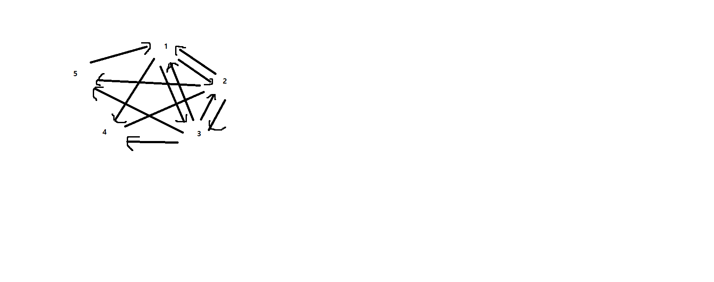

# 10 그래프 1 연습문제


1)

(1)


2) 

0 ->1

1 ->0->2->3

2 ->1

3 ->1


3)

(2) O(n)


4)

(2) 2e개


5)

(2) 너비 우선 탐색


6)

|      | 0    | 1    | 2    | 3    | 4    |
| ---- | ---- | ---- | ---- | ---- | ---- |
| 0    | 0    | 1    | 0    | 0    | 1    |
| 1    | 1    | 0    | 1    | 1    | 0    |
| 2    | 0    | 1    | 0    | 0    | 1    |
| 3    | 0    | 1    | 0    | 0    | 1    |
| 4    | 1    | 0    | 1    | 1    | 0    |


0 -> 1 -> 4

1 -> 0 -> -> 2 -> 3

2 -> 1 -> 4 

3 -> 1 -> 4

4 -> 0 -> 2 -> 3


7)


(1)

|           | 0    | 1    | 2    | 3    | 4    | 5    |
| --------- | ---- | ---- | ---- | ---- | ---- | ---- |
| 진입 차수 | 1    | 2    | 3    | 2    | 3    | 0    |
| 진출 차수 | 3    | 2    | 1    | 2    | 2    | 1    |


(2)

|                                | 0       | 1     | 2    | 3     | 4     | 5    |
| ------------------------------ | ------- | ----- | ---- | ----- | ----- | ---- |
| 각 정점에 인접한 정점들의 집합 | {1,2,3} | {2,3} | {4}  | {0,4} | {1,2} | {4}  |


(3) 인접 행렬 표현

|      | 0    | 1    | 2    | 3    | 4    | 5    |
| ---- | ---- | ---- | ---- | ---- | ---- | ---- |
| 0    | 0    | 50   | 45   | 10   | 0    | 0    |
| 1    | 0    | 0    | 10   | 15   | 0    | 0    |
| 2    | 0    | 0    | 0    | 0    | 30   | 0    |
| 3    | 20   | 0    | 0    | 0    | 15   | 0    |
| 4    | 0    | 20   | 35   | 0    | 0    | 0    |
| 5    | 0    | 0    | 0    | 0    | 3    | 0    |


(4) 인접 리스트 표현

0 -> 1, 50  -> 2,45  ->3,10

1 -> 2, 10  -> 3, 15

2 -> 4, 30

3 -> 0, 20  -> 4, 15

4  -> 1, 20  -> 2, 35

5 -> 4, 3


(5) 모든 사이클과 그 길이

* 사이클 : 단순 경로의 시작 정점과 종료 정점이 동일한 경로


( 0, 3, 0 ) - 2

( 0, 1, 3, 0 ) -3

( 1, 2, 4, 1 ) -3

(1, 3, 4, 1) -3

(0, 2, 4, 1, 3, 0) - 5


8)



9) 인접 배열


```c
//주어진 정점의 진출 차수 계산
int caculate_OutDegree(GraphType* g, int v)
{
    int i, degree=0;
    for(i=0; i<g->n; i++){
        if(g->adj_mat[v][i]!=0){
            degree++;
        }
    }
    return degree;
} //시간 복잡도 : O(n)
```

```c
//주어진 정점의 진입 차수 계산
int caculate_InDegree(GraphType* g, int v)
{
    int i, degree=0;
    for(i=0; i<g->n; i++){
        if(g->adj_mat[i][v]!=0){
            degree++;
        }
    }
    return degree;
}// 시간 복잡도 : O(n)
```

```c
//그래프 안에 있는 간선들의 개수 계산 함수
int calculate_num_edges(GraphType *g)
{
    int i,j, edges=0;
    for(i=0; i<g->n; i++){
        for(j=0; j<g->n; j++){
            if(g->adj_mat[i][j]!=0)
                edges++;
        }
    }
    return edges;
    
}//시간 복잡도: O(n^2)
```


10) 인접 리스트

```c
//주어진 정점의 진출 차수 계산
int caculate_OutDegree(GraphType* g, int v)
{
    int degree=0;
  	GraphNode *node = g->adj_list[v];
    
    while(node!=NULL){
        degree++;
        node=node->link;
    }
    return degree;
} //시간 복잡도 : O(e) (e:간선의 개수)
```

```c
//주어진 정점의 진입 차수 계산
int caculate_InDegree(GraphType* g, int v)
{
    int i, degree=0;
    GraphNode *node;
    
    for(i=0; i<g->n; i++){
        node=g->adj_list[i];
        
        while(node!=NULL){
            if(node->vertex == v)
                degree++;
            node = node->link;
        }
    }
    return degree;
}// 시간 복잡도 : 
```

```c
//그래프 안에 있는 간선들의 개수 계산 함수
int calculate_num_edges(GraphType *g)
{
    int i, edges=0;
    GraphNode *node;
    
    for(i=0; i<g->n; i++){
       node = g->adj_list[i];
        while(node!=NULL){
            degree++;
            node=node->link;
        }
    }
    return edges;
    
}//시간 복잡도: 
```


11)


12)


13)


(1) 3102456789

(2) 6531024789

(3)3145026789

(4)6573891402


14)

단절점: 하나의 컴포넌트로 구성된 무방향 그래프에서 특정 정점을 제거 했을때 두개 이상의 컴포넌트(그래프)로 나눌 수 있는 정점


1. 임의의 점을 선택한다.
2. 점마다 다음 2개의 정보를 기록하면서 DFS를 수행한다.
   * 방문한 순서(num)
   * 주변의 점(부모 제외) 중에서 가장 낮은 num(low)
3. 부모의 num과 자식이 물고온 low를 비교하여 부모가 단절점인지 판단한다.


```
if(부모의 num > 자식이 물고온 low)
	부모!=단절점
```

```
if(부모의 num<= 자식이 물고온 low)
	부모 ==단절점
```


http://blog.naver.com/PostView.nhn?blogId=lastingchild&logNo=140187693114&beginTime=0&jumpingVid=&from=search&redirect=Log&widgetTypeCall=true


https://www.crocus.co.kr/1164


15)

A B E G F C D

