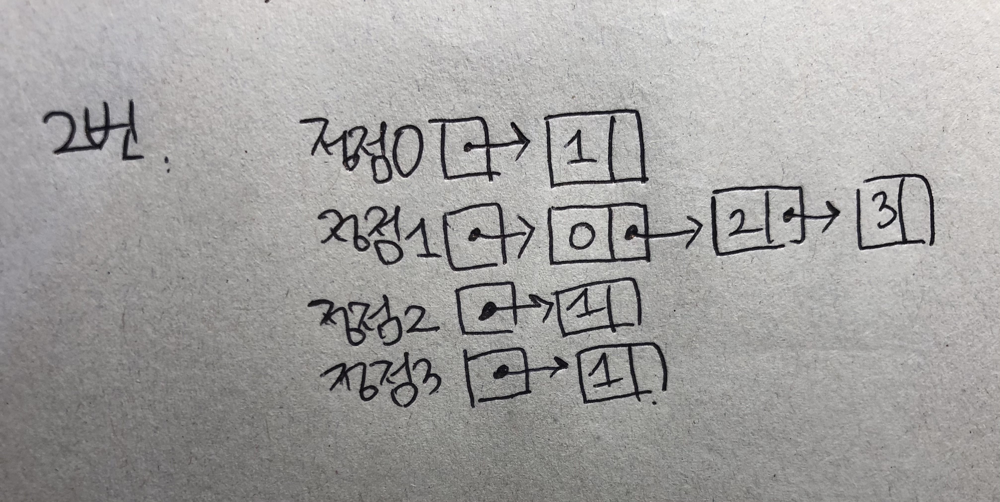
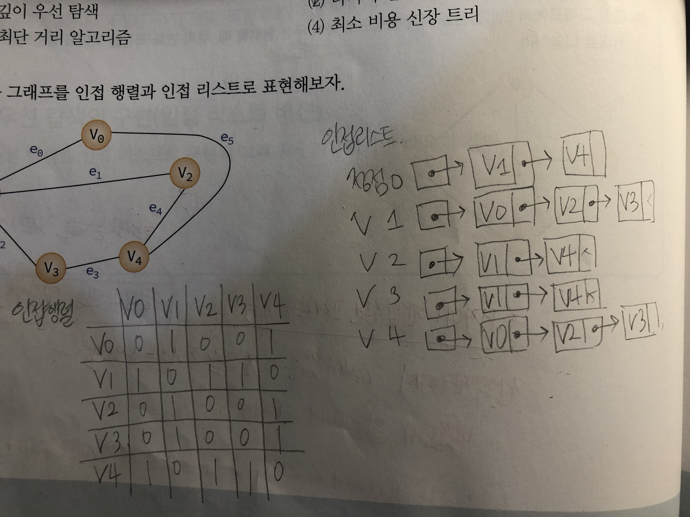
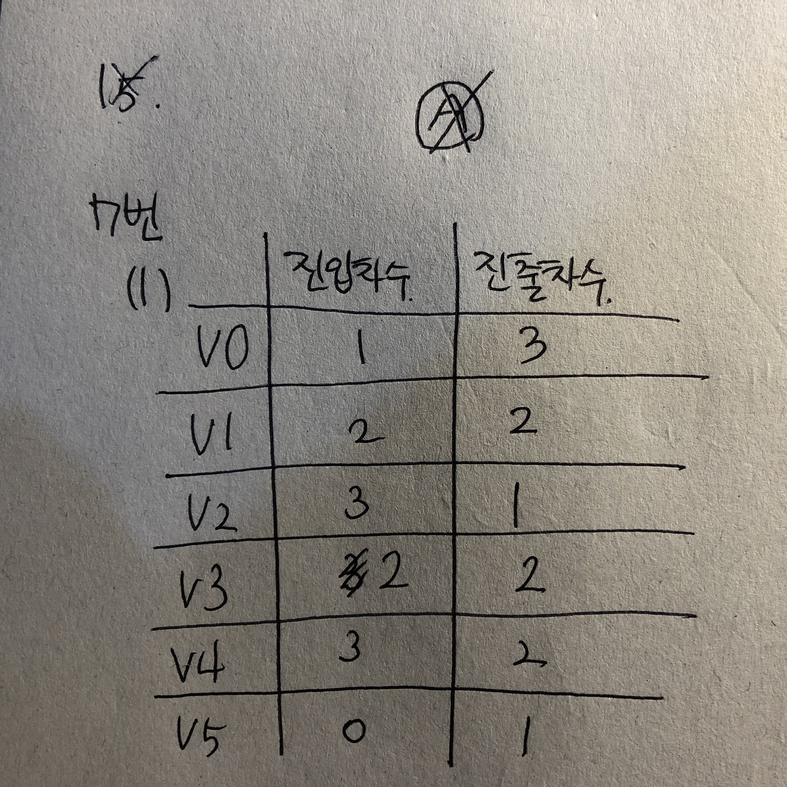
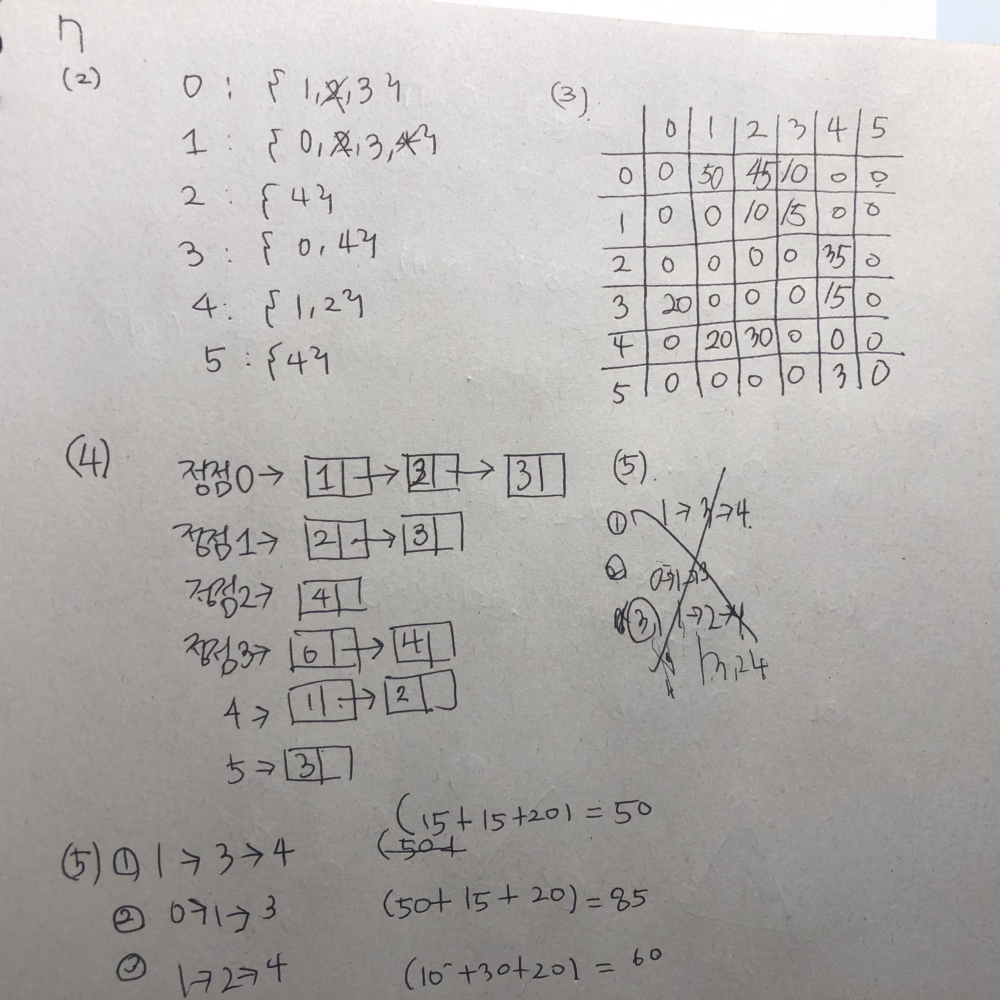
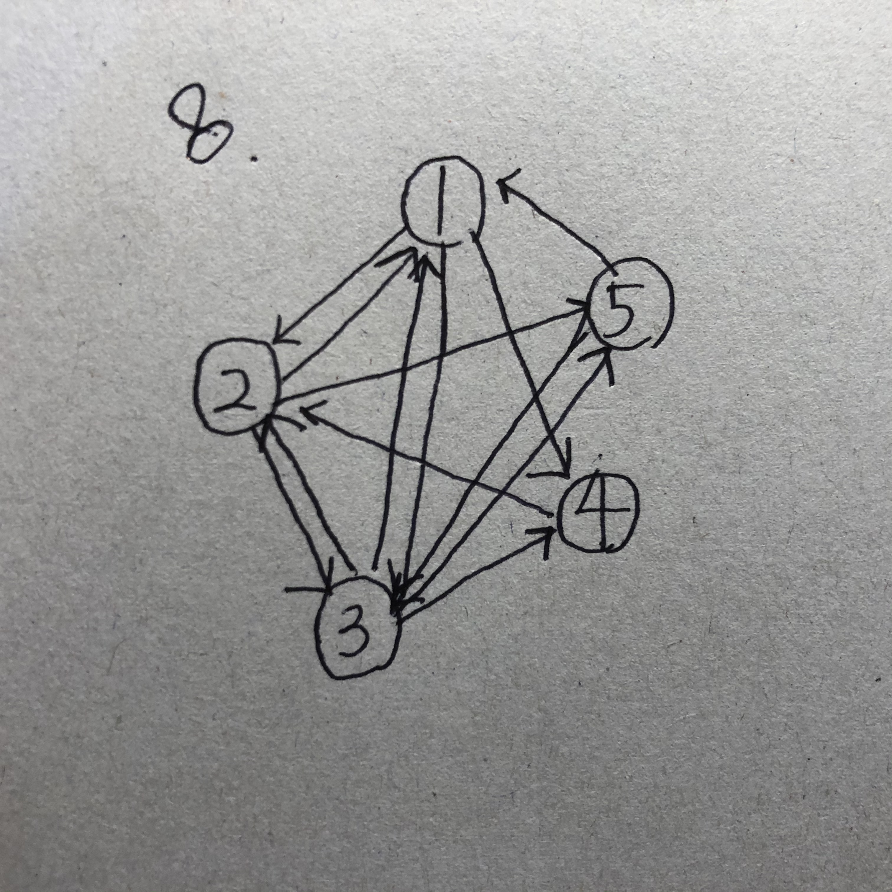
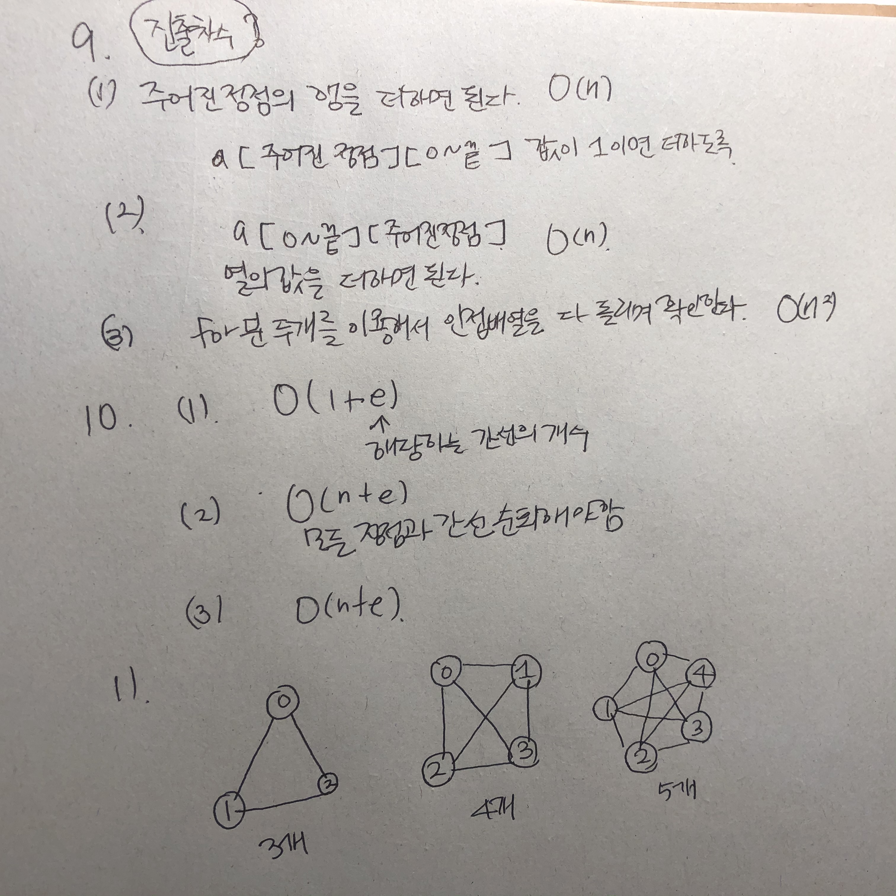
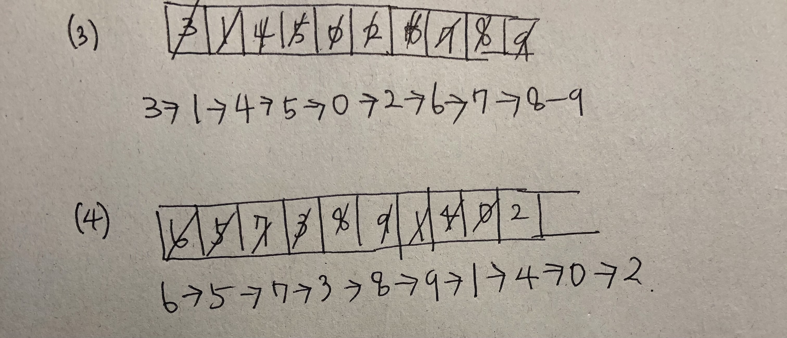

##### 1

(1) 인접행렬 v번째 행의 값들을 전부 더한다.


##### 2




##### 3 

(2) O(n) : 특정 정점의 행을 탐색하면 되므로 n개를 찾으면 된다. 그러므로 O(n)이다.


##### 4

(2) 2e개 : 각 정점에 연결되어 있는 정점들이 다 추가가 되므로 간선의 두배가 필요하다. 노드의 개수는 2e개이다. 


##### 5

너비 우선 탐색 : 트리에 인접한 노드를 삽입하고 그 인접한 노드가 나오게 될때 그 노드의 또 다른 인접한 노드들이 큐에 들어간다.


##### 6



##### 7






##### 8



##### 9, 10, 11




##### 12


##### 13

(1,2)

```
(1)
3->1->0->2->4->5->6->7->8->9
(2)
6->5->3->1->0->2->4->7->8->9
```


(3,4)



##### 14


##### 15

A  -> B  -> C  -> D  -> E  -> F -> G 