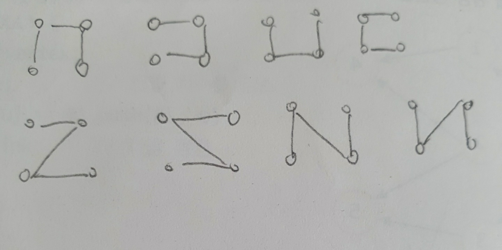

## 자료구조 ch.11 그래프2

1>




2>

AD->CE->DF->AB->BE->EG


3> A D F B E C G


4>

```c
#include <stdio.h>
#include <stdlib.h>

#define TRUE 1
#define FALSE 0
#define MAX_VERTICES 100
#define INF 1000L

typedef struct GraphType {
	int n; //정점의 개수
	int weight[MAX_VERTICES][MAX_VERTICES];
}GraphType;

int selected[MAX_VERTICES];
int distance[MAX_VERTICES];

//최소 dist[v] 값을 갖는 정점을 반환
int get_min_vertex(int n)
{
	int v, i;
	for(i=0; i<n; i++)
		if (!selected[i]) {
			v = i;
			break;
		}
	for (i = 0; i < n; i++)
		if (!selected[i] && (distance[i] < distance[v])) v = i;
	return (v);
}

void prim(GraphType* g, int s)
{
	int i, u, v;

	for (u = 0; u < g->n; u++)
		distance[u] = INF;
	distance[s] = 0;
	for (i = 0; i < g->n; i++)
	{
		u = get_min_vertex(g->n);
		selected[u] = TRUE;
		///////////////
		printf("selected ");
		for(int i=0; i<g->n; i++)
		{ 
			printf("%d ", selected[i]);
		}
		printf("\ndistance ");
		for (int i = 0; i < g->n; i++) {
			printf("%d ", distance[i]);
		}
		printf("\n");
		/////////////////
		if (distance[u] == INF) return;

		printf("정점 %d 추가 \n", u);

		for (v = 0; v < g->n; v++)
			if (g->weight[u][v] != INF)
				if (!selected[v] && g->weight[u][v] < distance[v])
					distance[v] = g->weight[u][v];


	}
}

int main(void)
{
	GraphType g = { 7,
	{{ 0, 29, INF, INF, INF, 10, INF },
	{ 29,  0, 16, INF, INF, INF, 15 },
	{ INF, 16, 0, 12, INF, INF, INF },
	{ INF, INF, 12, 0, 22, INF, 18 },
	{ INF, INF, INF, 22, 0, 27, 25 },
	{ 10, INF, INF, INF, 27, 0, INF },
	{ INF, 15, INF, 18, 25, INF, 0 } }
	};
	prim(&g, 0);
	return 0;
}


```

distance[] : 인접 정점의 가중치

selected[] : 선택한 정점


5>

| 단계 | 선택된 정점 | found 배열  | distance 배열   |
| ---- | ----------- | ----------- | --------------- |
| 1    | 0           | 1 0 0 0 0 0 | 0 50 45 10 * *  |
| 2    | 3           | 1 0 0 1 0 0 | 0 50 45 10 25 * |
| 3    | 4           | 1 0 0 1 1 0 | 0 45 45 10 25 * |
| 4    | 1           | 1 1 0 1 1 0 | 0 45 45 10 25 * |
| 5    | 2           | 1 1 1 1 1 0 | 0 45 45 10 25 * |
|      |             |             |                 |


6>

```c
#include <stdio.h>
#include <stdlib.h>

#define TRUE 1
#define FALSE 0
#define MAX_VERTICES	100	
#define INF	1000000	           /* 무한대 (연결이 없는 경우) */

typedef struct GraphType
{
	int n;	                  // 정점의 개수
	int weight[MAX_VERTICES][MAX_VERTICES];
} GraphType;

int A[MAX_VERTICES][MAX_VERTICES];

void printA(GraphType *g)
{
	int i, j;
	printf("===============================\n");
	for (i = 0; i < g->n; i++){
		for (j = 0; j < g->n; j++){
			if(A[i][j]==INF)
				printf(" * ");
			else printf("%3d ", A[i][j]);
	}
	printf("\n");
	}
	printf("===============================\n");
}

void floyd(GraphType* g)
{

	int i, j, k;
	for (i = 0; i < g->n; i++)
		for (j = 0; j < g->n; j++)
			A[i][j] = g->weight[i][j];
	printA(g);

	for (k = 0; k < g->n; k++)
	{
		for (i = 0; i < g->n; i++)
			for (j = 0; j < g->n; j++)
				if (A[i][k] + A[k][j] < A[i][j])
					A[i][j] = A[i][k] + A[k][j];
		printA(g);
	}
}

int main(void)
{
	GraphType g = { 6,
	{{ 0, 50, 45, 10,INF,INF },
	{ INF,0,0,15,INF,INF },
	{ INF,INF,0,INF,30,INF },
	{ 20,INF,INF,0,15,INF },
	{ INF,20,35,INF,0,INF },
	{ INF,INF,INF,INF,3,0 } }
	};
	floyd(&g);
	return 0;
}


```

출력결과

```
===============================
  0  50  45  10  *  *
 *   0   0  15  *  *
 *  *   0  *  30  *
 20  *  *   0  15  *
 *  20  35  *   0  *
 *  *  *  *   3   0
===============================
===============================
  0  50  45  10  *  *
 *   0   0  15  *  *
 *  *   0  *  30  *
 20  70  65   0  15  *
 *  20  35  *   0  *
 *  *  *  *   3   0
===============================
===============================
  0  50  45  10  *  *
 *   0   0  15  *  *
 *  *   0  *  30  *
 20  70  65   0  15  *
 *  20  20  35   0  *
 *  *  *  *   3   0
===============================
===============================
  0  50  45  10  75  *
 *   0   0  15  30  *
 *  *   0  *  30  *
 20  70  65   0  15  *
 *  20  20  35   0  *
 *  *  *  *   3   0
===============================
===============================
  0  50  45  10  25  *
 35   0   0  15  30  *
 *  *   0  *  30  *
 20  70  65   0  15  *
 55  20  20  35   0  *
 *  *  *  *   3   0
===============================
===============================
  0  45  45  10  25  *
 35   0   0  15  30  *
 85  50   0  65  30  *
 20  35  35   0  15  *
 55  20  20  35   0  *
 58  23  23  38   3   0
===============================
===============================
  0  45  45  10  25  *
 35   0   0  15  30  *
 85  50   0  65  30  *
 20  35  35   0  15  *
 55  20  20  35   0  *SS
 58  23  23  38   3   0
===============================
```


7>


8>

```c
#include <stdio.h>
#include <stdlib.h>
#include <limits.h>

#define TRUE 1
#define FALSE 0
#define MAX_VERTICES	100	
#define INF	1000000	           /* 무한대 (연결이 없는 경우) */

typedef struct GraphType
{
	int n;	                  // 정점의 개수
	int weight[MAX_VERTICES][MAX_VERTICES];
} GraphType;

int distance[MAX_VERTICES];   /* 시작정점으로부터의 최단경로 거리 */
int found[MAX_VERTICES];      /* 방문한 정점 표시 */

int choose(int distance[], int n, int found[])
{
	int i, min, minpos;
	min = INT_MAX;
	minpos = -1;
	for (i = 0; i < n; i++)
		if (distance[i] < min && !found[i]) {
			min = distance[i];
			minpos = i;
		}
	return minpos;
}

void print_status(GraphType* g)
{
	static int step = 1;
	printf("STEP %d: ", step++);
	printf("distance: ");
	for (int i = 0; i < g->n; i++) {
		if (distance[i] == INF)
			printf(" * ");
		else
			printf("%2d ", distance[i]);
	}
	printf("\n");
	printf(" found: ");
	for (int i = 0; i < g->n; i++)
		printf("%2d ", found[i]);
	printf("\n\n");
}

void shortest_path(GraphType* g, int start)
{
	int i, u, w;
	for (i = 0; i < g->n; i++) //초기화
	{
		distance[i] = g->weight[start][i];
		found[i] = FALSE;
	}
	found[start] = TRUE;
	distance[start] = 0;
	for (i = 0; i < g->n - 1; i++) {
		print_status(g);
		u = choose(distance, g->n, found);
		found[u] = TRUE;


		printf("경로 : %d> ", u);
		

		for (w = 0; w < g->n; w++)
			if (!found[w])
				if (distance[u] + g->weight[u][w] < distance[w])
					distance[w] = distance[u] + g->weight[u][w];
	}
}

int main(void)
{
	GraphType g = { 7,
	{{ 0,  7,  INF, INF,   3,  10, INF },
	{ 7,  0,    4,  10,   2,   6, INF },
	{ INF,  4,    0,   2, INF, INF, INF },
	{ INF, 10,    2,   0,  11,   9,   4 },
	{ 3,  2,  INF,  11,   0, INF,   5 },
	{ 10,  6,  INF,   9, INF,   0, INF },
	{ INF, INF, INF,   4,   5, INF,   0 } }
	};


	shortest_path(&g, 0);
	return 0;
}

```


9>

```c
#include <stdio.h>
#include <stdlib.h>
#include <limits.h>

#define TRUE 1
#define FALSE 0
#define MAX_VERTICES	100	
#define INF	1000000	           /* 무한대 (연결이 없는 경우) */

typedef struct GraphType
{
	int n;	                  // 정점의 개수
	int weight[MAX_VERTICES][MAX_VERTICES];
} GraphType;

int distance[MAX_VERTICES];   /* 시작정점으로부터의 최단경로 거리 */
int found[MAX_VERTICES];      /* 방문한 정점 표시 */

int choose(int distance[], int n, int found[])
{
	int i, min, minpos;
	min = INT_MAX;
	minpos = -1;
	for (i = 0; i < n; i++)
		if (distance[i] < min && !found[i]) {
			min = distance[i];
			minpos = i;
		}
	return minpos;
}
/*
void print_status(GraphType* g)
{
	static int step = 1;
	printf("STEP %d: ", step++);
	printf("distance: ");
	for (int i = 0; i < g->n; i++) {
		if (distance[i] == INF)
			printf(" * ");
		else
			printf("%2d ", distance[i]);
	}
	printf("\n");
	printf(" found: ");
	for (int i = 0; i < g->n; i++)
		printf("%2d ", found[i]);
	printf("\n\n");
}*/

void shortest_path(GraphType* g, int start)
{
	int i, u, w;
	for (i = 0; i < g->n; i++) //초기화
	{
		distance[i] = g->weight[start][i];
		found[i] = FALSE;
	}
	found[start] = TRUE;
	distance[start] = 0;
	for (i = 0; i < g->n - 1; i++) {
		//print_status(g);
		u = choose(distance, g->n, found);
		found[u] = TRUE;

		static int step = 1;
		printf("STEP %d: ", step++);
		printf("distance: ");
		for (int i = 0; i < g->n; i++) {
			if (distance[i] == INF)
				printf(" * ");
			else
				printf("%2d ", distance[i]);
		}
		printf("\n");

		for(w=0; w<g->n; w++)
			if(!found[w])
				if(distance[u]+g->weight[u][w] < distance[w])
					distance[w] = distance[u] + g->weight[u][w];		
	}
}

int main(void)
{
	GraphType g = { 7,
	{{ 0,  7,  INF, INF,   3,  10, INF },
	{ 7,  0,    4,  10,   2,   6, INF },
	{ INF,  4,    0,   2, INF, INF, INF },
	{ INF, 10,    2,   0,  11,   9,   4 },
	{ 3,  2,  INF,  11,   0, INF,   5 },
	{ 10,  6,  INF,   9, INF,   0, INF },
	{ INF, INF, INF,   4,   5, INF,   0 } }
	};


	shortest_path(&g,0);
	return 0;
}


```

distance[] 배열: 시작정점에서 집합 S에 있는 정점만을 거쳐서 다른 정점으로 가는 최단거리를 기록하는 1차원 배열 


10> 

cs1 - cs2 - cs3 - cs4 - cs5 - cs6 - cs7 - cs8 