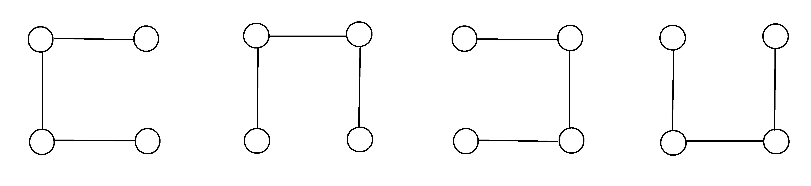
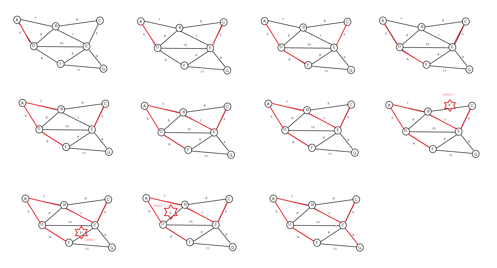
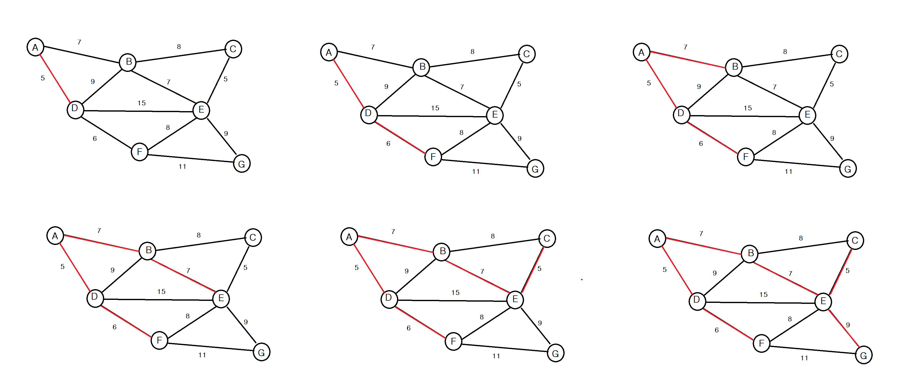
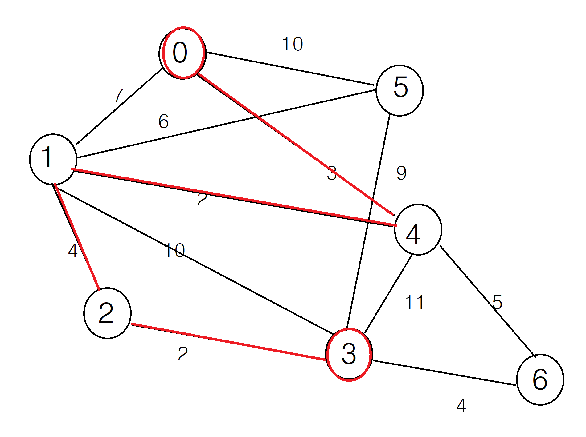

# Chapter 11. Graph 2

------

01.




02.




03.



 

04.

distance : 현재까지 알려진, 신장트리 정점 `집합`에서 `각 정점`까지의 거리

selected : 정점 집합으로 선택된 vertex들.

```c
#include <stdio.h>
#include <stdlib.h>

#define true 1
#define false 0
#define MAX_VERTICES 100
#define inf 1000L

typedef struct Graphtype {
	int n;
	int weight[MAX_VERTICES][MAX_VERTICES];
}GraphType;

int selected[MAX_VERTICES];
int distance[MAX_VERTICES];

// 최소 dist[v]를 값을 갖는 정점을 반환
int get_min_vertex(int n) {
	int v;

	for (int i = 0; i < n; i++) {
		if (!selected[i]) {
			v = i;
			break;
		}
	}

	for (int i = 0; i < n; i++) {
		if (!selected[i] && (distance[i] < distance[v])) v = i;
	}

	return v;
}

//void prim(GraphType* g, int s) {
//	int u, v;
//
//	for (u = 0; u < g->n; u++) distance[u] = inf;
//	distance[s] = 0;
//
//	for (int i = 0; i < g->n; i++) {
//		u = get_min_vertex(g->n);
//		selected[u] = true;
//
//		if (distance[u] == inf) return;
//
//		printf("정점 %d 추가\n", u);
//		for (v = 0; v < g->n; v++) {
//			if (g->weight[u][v] != inf) {
//				if (!selected[v] && g->weight[u][v] < distance[v]) {
//					distance[v] = g->weight[u][v];
//				}
//			}
//		}
//	}
//}

```


```C
#include "prim.h"

void print_dist_and_selected(GraphType* g)
{
	printf("distance[ ] = [ ");
	for (int i = 0; i < g->n; i++)
		printf("%d ", distance[i]);
	printf("]\n");

	printf("selected[ ] = [ ");
	for (int i = 0; i < g->n; i++)
		printf("%d ", selected[i]);
	printf("]\n\n");
}

void prim(GraphType* g, int s) {
	int u, v;

	for (u = 0; u < g->n; u++) distance[u] = inf;
	distance[s] = 0;

	for (int i = 0; i < g->n; i++) {
		u = get_min_vertex(g->n);
		selected[u] = true;

		if (distance[u] == inf) return;

		printf("정점 %d 추가\n", u);
		print_dist_and_selected(g);
		for (v = 0; v < g->n; v++) {
			if (g->weight[u][v] != inf) {
				if (!selected[v] && g->weight[u][v] < distance[v]) {
					distance[v] = g->weight[u][v];
				}
			}
		}
	}
}

void main() {
	GraphType g = { 7,
	 {{ 0, 29, inf, inf, inf, 10, inf },
	 { 29, 0, 16, inf, inf, inf, 15 },
	 { inf, 16, 0, 12, inf, inf, inf },
	 { inf, inf, 12, 0, 22, inf, 18 },
	 { inf, inf, inf, 22, 0, 27, 25 },
	 { 10, inf, inf, inf, 27, 0, inf },
	 { inf, 15, inf, 18, 25, inf, 0 } }
	};

	prim(&g, 0);
	return ;
}
```


05.

| 단계 | 선택된 정점 |    found 배열    |      distance 배열      |
| :--: | :---------: | :--------------: | :---------------------: |
|  1   |      0      | 1, 0, 0, 0, 0, 0 | 0, 50, 45, 10, inf, inf |
|  2   |      3      | 1, 0, 0, 1, 0, 0 | 0, 50, 45, 10, 25, inf  |
|  3   |      4      | 1, 0, 0, 1, 1, 0 | 0, 45, 45, 10, 25, inf  |
|  4   |      1      | 1, 0, 0, 1, 1, 0 | 0, 45, 45, 10, 25, inf  |
|  5   |      2      | 1, 0, 0, 1, 1, 0 | 0, 45, 45, 10, 25, inf  |
|  6   |      5      | 1, 0, 0, 1, 1, 0 | 0, 45, 45, 10, 25, inf  |

 

06.

```c
#include <stdio.h>
#include <stdlib.h>

#define true 1
#define false 0
#define MAX_VERTICES 100
#define inf 100000

typedef struct GraphType {
	int n; // 정점의 개수
	int weight[MAX_VERTICES][MAX_VERTICES];
}GraphType;

int A[MAX_VERTICES][MAX_VERTICES];

void printA(GraphType* g) {
	printf("==============================\n");
	for (int i = 0; i < g->n; i++) {
		for (int j = 0; j < g->n; j++) {
			if (A[i][j] == inf) printf("  * ");
			else printf("%3d ", A[i][j]);
		}
		printf("\n");
	}
	printf("==============================\n");
}

void floyd(GraphType* g) {
	for (int i = 0; i < g->n; i++) {
		for (int j = 0; j < g->n; j++) {
			A[i][j] = g->weight[i][j];
		}
	}
	printA(g);

	for (int k = 0; k < g->n; k++) {
		for (int i = 0; i < g->n; i++) {
			for (int j = 0; j < g->n; j++) {
				if (A[i][k] + A[k][j] < A[i][j]) {
					A[i][j] = A[i][k] + A[k][j];
				}
			}
		}
		printA(g);
	}
}
```


```c
#include "floyd.h"

void main() {
	GraphType g = { 6,
	 {{ 0, 50, 45, 10, inf, inf },
	 { inf, 0, 10, 15, inf, inf },
	 { inf, inf, 0, inf, 30, inf },
	 { 20, inf, inf, 0, 15, inf },
	 { inf, 20, 35, inf, 0, inf },
	 { inf, inf, inf, inf, 3, 0 }}
	};

	floyd(&g);
	return;
}
```


07.

```c

```


08.

```c
#include "dikstra.h"

int before[100];
void shortest_path(GraphType* g, int start)
{
	int i, u, w;
	int count = 0;
	for (i = 0; i < g->n; i++)
	{
		distance[i] = g->weight[start][i];
		before[i] = start; // 시작정점을 전역변수 path에 저장.
		found[i] = false;
	}
	found[start] = true;
	distance[start] = 0;
	for (i = 0; i < g->n - 1; i++) {
		print_status(g);
		u = choose(distance, g->n, found);
		found[u] = true;
		for (w = 0; w < g->n; w++)
			if (!found[w])
				if (distance[u] + g->weight[u][w] < distance[w])
				{
					distance[w] = distance[u] + g->weight[u][w];
					before[w] = u; // w의 before은 u
					printf("%d ", ++count);
				}
	}
}
void print_path(int start, int end) // 경로를 출력
{
	if (before[end] != start) {
		print_path(start, before[end]);
	}
	printf("(%d -> %d) ->", before[end], end);
}

int main(void)
{
	int start, end;

	GraphType g = { 7,
	 {{ 0, 7, inf, inf, 3, 10, inf },
	 { 7, 0, 4, 10, 2, 6, inf },
	 { inf, 4, 0, 2, inf, inf, inf },
	 { inf, 10, 2, 0, 11, 9, 4 },
	 { 3, 2, inf, 11, 0, inf, 5 },
	 { 10, 6, inf, 9, inf, 0, inf },
	 { inf, inf, inf, 4, 5, inf, 0 } }
	};
	printf("시작 정점 입력 : ");
	scanf("%d", &start);
	getchar();

	shortest_path(&g, start);

	printf("끝 정점 입력 : ");
	scanf("%d", &end);

	printf("%d 부터 %d까지의 최단 경로는\n", start, end);
	print_path(start, end);

	//for (int i = 0; i < 7; i++) {
	//	printf("%d ", before[i]);
	//}
	return 0;
}

```



09.

```c
#include <stdio.h>
#include <stdlib.h>
#include <limits.h>

#define true 1
#define false 0
#define MAX_VERTICES 100
#define inf 100000

typedef struct GraphType {
	int n;
	int weight[MAX_VERTICES][MAX_VERTICES];
}GraphType;

int distance[MAX_VERTICES]; // 집합 S에 있는 정점만을 거쳐서 다른 정점으로 가는 최단거리
int found[MAX_VERTICES]; // 방문한 정점 표시

int choose(int distance[], int n, int found[]) {
	int min, minpos;
	min = INT_MAX;
	minpos = -1;
	for (int i = 0; i < n; i++) {
		if (distance[i] < min && !found[i]) {
			min = distance[i];
			minpos = i;
		}
	}
	return minpos;
}

void print_status(GraphType* g) {
	static int step = 1;
	printf("STEP %d :\n", step++);
	printf("distance: ");
	for (int i = 0; i < g->n; i++) {
		if (distance[i] == inf) printf(" * ");
		else printf("%2d ", distance[i]);
	}
	printf("\nfound   : ");
	for (int i = 0; i < g->n; i++) printf("%2d ", found[i]);
	printf("\n\n");
}

//
void shortest_path(GraphType* g, int start) {
	int u, w;
	for (int i = 0; i < g->n; i++) {
		distance[i] = g->weight[start][i];
		found[i] = false;
	}
	found[start] = true; // 시작 정점 방문 표시
	distance[start] = 0;
	for (int i = 0; i < g->n - 1; i++) {
		print_status(g);
		u = choose(distance, g->n, found);
		found[u] = true;
		for (w = 0; w < g->n; w++) {
			if (!found[w]) {
				if (distance[u] + g->weight[u][w] < distance[w]) 
					distance[w] = distance[u] + g -> weight[u][w];
			}
		}
	}
}
```


```c
#include "dikstra.h"

void main() {
	GraphType g = { 7,
	 {{ 0, 29, inf, inf, inf, 10, inf },
	 { 29, 0, 16, inf, inf, inf, 15 },
	 { inf, 16, 0, 12, inf, inf, inf },
	 { inf, inf, 12, 0, 22, inf, 18 },
	 { inf, inf, inf, 22, 0, 27, 25 },
	 { 10, inf, inf, inf, 27, 0, inf },
	 { inf, 15, inf, 18, 25, inf, 0 } }
	};

	shortest_path(&g, 0);
	return;
}
```

시작 정점에서 집합 S에 있는 정점만을 거쳐서 다른 정점으로 가는 최단거리를 기록하는 배열


10.

```c
#include <stdio.h>
#include <stdlib.h>
#define true 1
#define false 0
#define MAX_VERTICES 50

typedef struct GraphNode {
	int vertex;
	struct GraphNode* link;
}GraphNode;

typedef struct GraphType {
	int n; // 정점의 개수
	GraphNode* adj_list[MAX_VERTICES];
}GraphType;

// 그래프 초기화
void graph_init(GraphType* g) {
	g->n = 0;
	for (int v = 0; v < MAX_VERTICES; v++) {
		g->adj_list[v] = NULL;
	}
}

// 정점 삽입 연산
void insert_vertex(GraphType* g, int v) {
	if ((g->n) + 1 > MAX_VERTICES) {
		printf("그래프 정점 개수 초과");
		return;
	}
	g->n++;
}

// 간선 삽입 연산, v를 u의 인접 리스트에 삽입한다.
void insert_edge(GraphType* g, int u, int v) {
	GraphNode* node;
	u = u - 1;
	v = v - 1;
	if (u >= g->n || v >= g->n) {
		printf("그래프 정점 번호 오류!");
		return;
	}
	node = (GraphNode*)malloc(sizeof(GraphNode));
	node->vertex = v;
	node->link = g->adj_list[u];
	g->adj_list[u] = node;
}

////////////////////////////////////////////////////////
#define MAX_STACK_SIZE 100
typedef int element;
typedef struct {
	element stack[MAX_STACK_SIZE];
	int top;
}StackType;

// 스택 초기화 함수
void init(StackType* s) {
	s->top = -1;
}

// 공백 검출
int is_empty(StackType* s) {
	return (s->top == -1);
}

// 포화 상태 검출
int is_full(StackType* s) {
	return (s->top == (MAX_STACK_SIZE - 1));
}

// 삽입
void push(StackType* s, element item) {
	if (is_full(s)) {
		printf("스택 포화 err!");
		return;
	}
	else s->stack[++(s->top)] = item;
}

// 삭제
element pop(StackType* s) {
	if (is_empty(s)) {
		printf("스택 공백 err!");
		exit(1);
	}
	else {
		return s->stack[(s->top)--];
	}
}

void topo_sort(GraphType* g) {
	StackType s;
	GraphNode* node;

	// 모든 정점의 진입 차수를 계산
	int* in_degree = (int*)malloc(g->n * sizeof(int));
	for (int i = 0; i < g->n; i++) in_degree[i] = 0;
	for (int i = 0; i < g->n; i++) {
		GraphNode* node = g->adj_list[i];
		while (node != NULL) {
			in_degree[node->vertex]++;
			node = node->link;
		}
	}

	// 진입 차수가 0인 정점을 스택에 삽입
	init(&s);
	for (int i = 0; i < g->n; i++) {
		if (in_degree[i] == 0) push(&s, i);
	}

	// 위상 순서를 생성
	while (!is_empty(&s)) {
		int w;
		w = pop(&s);
		printf("정점 cs%d ->", w+1); // 정점 출력
		node = g->adj_list[w]; // 각 정점의 진입 차수를 변경
		while (node != NULL) {
			int u = node->vertex;
			in_degree[u]--;
			if (in_degree[u] == 0) push(&s, u);
			node = node->link;
		}
	}
	free(in_degree);
	printf("\n");
	return ;
}


```


```c
#include "topological_sort.h"

void main() {
	GraphType g;

	graph_init(&g);
	for (int i = 0; i < 8; i++) {
		insert_vertex(&g, i);
	}
	insert_edge(&g, 1, 2);
	insert_edge(&g, 2, 3);
	insert_edge(&g, 2, 4);
	insert_edge(&g, 2, 5);
	insert_edge(&g, 3, 8);
	insert_edge(&g, 4, 7);
	insert_edge(&g, 5, 6);
	insert_edge(&g, 5, 7);
	insert_edge(&g, 6, 8);
	insert_edge(&g, 7, 8);

	topo_sort(&g);
}
```

