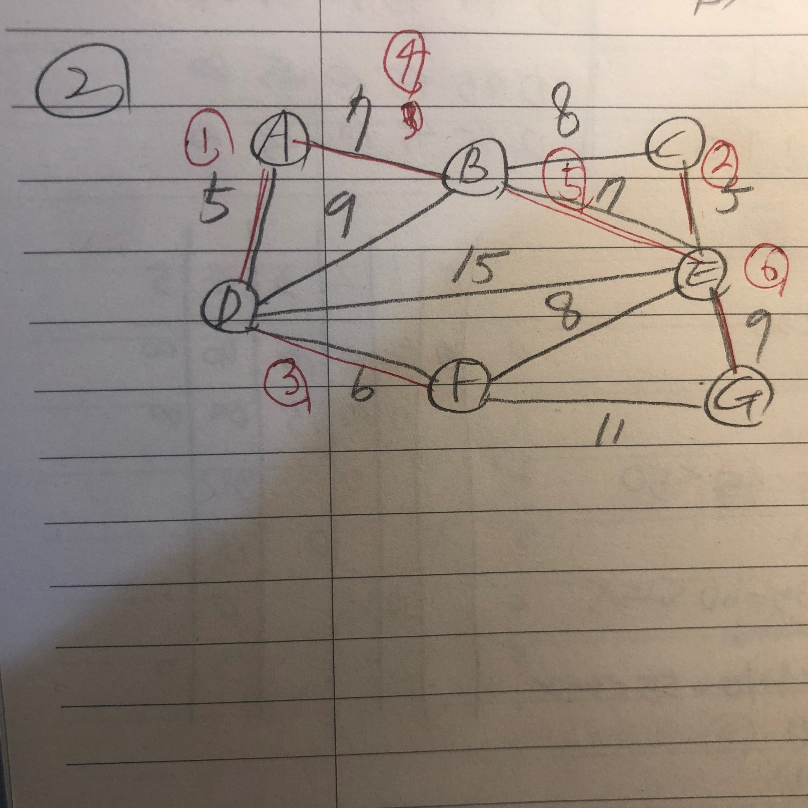
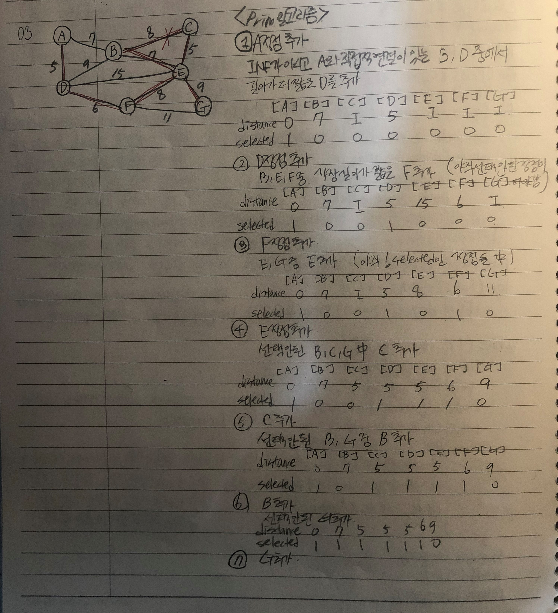
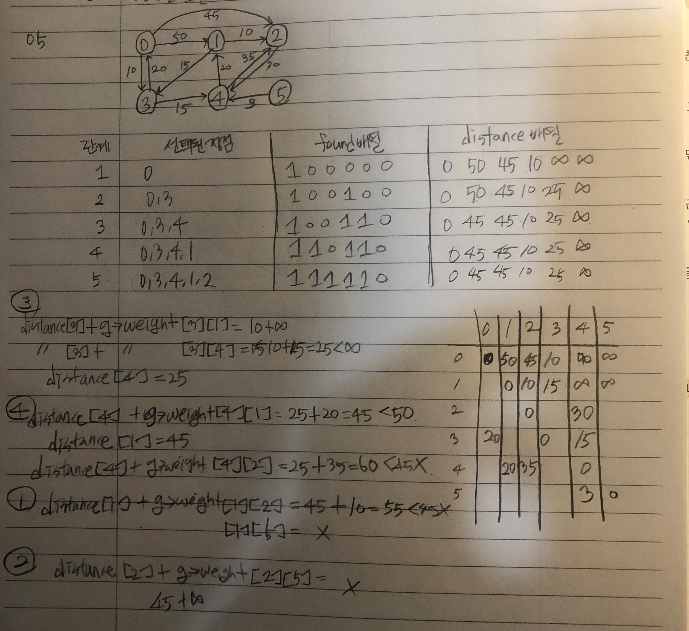

##### 1


##### 2

(A,D)->(C,E)->(D,F)->(A,B)->(B,E)->(E,G)




##### 3

(A->D->F->E->C->B->G)




##### 4

distance[]를 보면서 현재 연결된 정점들로부터 아직 트리 집합에 포함이 안되고 연결이 안된 다른 정점들까지의 거리가 어느정도 인지 알 수 있다. 최소 가중치 값으로 연결이 되고 포함이 되면서 다른 포함 안된 정점과의 거리가 기존 거리값보다 작으면 갱신한다. selected[]를 보면 시작 정점으로부터 연결이 되어가는 과정을 확인 할 수 있다.

```c
void prim(GraphType* g, int s)
{
	int i, u, v, j,k;

	for (u = 0; u < g->n; u++)
		distance[u] = INF;
	distance[s] = 0;
	for (i = 0; i < g->n; i++) {
		u = get_min_vertex(g->n);
		selected[u] = TRUE;
		if (distance[u] == INF) return;
		printf("정점 %d 추가\n", u);
		for (v = 0; v < g->n; v++)
			if (g->weight[u][v] != INF)
				if (!selected[v] && g->weight[u][v] < distance[v])
					distance[v] = g->weight[u][v];
		printf("distance: ");
		for (j = 0;j < g->n;j++) {
			printf("%d ", distance[j]);
		}
		printf("\n");
		printf("selected: ");
		for (k = 0;k < g->n;k++) {
			printf("%d ", selected[k]);
		}
		printf("\n");
	}
}
```


##### 5

0->3->4->1->2




##### 6 

(기존의 코드를 수정)

```c
void printA(GraphType* g)
{
	int i, j;
	printf("===============================\n");
	for (i = 0; i < g->n; i++) {
		for (j = 0; j < g->n; j++) {
			if (A[i][j] == INF)
				printf("  * ");
			else printf("%3d ", A[i][j]);
		}
		printf("\n");
	}
	printf("===============================\n");
}

void floyd(GraphType* g)
{

	int i, j, k;
	for (i = 0; i < g->n; i++)
		for (j = 0; j < g->n; j++)
			A[i][j] = g->weight[i][j];
	printA(g);

	for (k = 0; k < g->n; k++) {
		for (i = 0; i < g->n; i++)
			for (j = 0; j < g->n; j++)
				if (A[i][k] + A[k][j] < A[i][j])
					A[i][j] = A[i][k] + A[k][j];
		printA(g);
	}
}
```


##### 7

```c
#include<stdio.h>

#define INFINITE 9999
#define NUM_VERTICES 7

typedef struct Adjacency
{
	struct Adjacency* link;		// 연결
	int vertex;					// 정점
	int weight;					// 무게
}Adjacency;

// 인접 리스트
Adjacency* Graph_list[NUM_VERTICES];

void initGraph();
void insertEdge(int, int, int);
void DijkstraShortestPathsSingleTargetCount(int);
void print_status(int distance[], int found[]);
void main()
{
	char start, end;

	// 그래프 생성.
	initGraph();

	// 시점, 종점 입력
	start = 'A';

	printf("시점 >> %c\n",start);


	DijkstraShortestPathsSingleTargetCount(start - 'A'); // 다익스트라 알고리즘 실행
}

// 그래프를 초기화해주는 함수 - 간선 수만큼 연결해줘야 한다.
void initGraph() {
	// A의 연결점 추가
	insertEdge(0, 1, 7);	// A-B
	insertEdge(0, 4, 3);	// A-C
	insertEdge(0, 5, 10);	// A-D
	insertEdge(0, 5, 10);	// A-D

	// B의 연결점 추가
	insertEdge(1, 2, 4);	// B-C
	insertEdge(1, 3, 10);	// B-E
	insertEdge(1, 4, 2);	// B-E
	insertEdge(1, 5, 6);	// B-E

	// C의 연결점 추가 
	insertEdge(2, 3, 2);	// C-D
	
	// D의 연결점 추가
	insertEdge(3, 4, 11);	// D-F
	insertEdge(3, 5, 9);	// D-F
	insertEdge(3, 6, 4);	// D-F

	// E의 연결점 추가 - 이미 위에서 완료
	insertEdge(4, 6, 5);	// D-F

	// F의 연결점 추가 - 이미 위에서 완료
}

void insertEdge(int start, int end, int weight)
{
	Adjacency* node;	// 연결을 위한 노드

	// 양방향으로 연결을 해줘야 한다.
	node = (Adjacency*)malloc(sizeof(Adjacency));
	node->vertex = end;
	node->weight = weight;
	node->link = Graph_list[start];
	Graph_list[start] = node;

	// 반대쪽에서도 연결
	node = (Adjacency*)malloc(sizeof(Adjacency));
	node->vertex = start;
	node->weight = weight;
	node->link = Graph_list[end];
	Graph_list[end] = node;
}

void DijkstraShortestPathsSingleTargetCount(int start)
{
	int distance[NUM_VERTICES];		// 거리
	int	pathcnt[NUM_VERTICES];		// 경로 수
	int found[NUM_VERTICES];		// 가방 안에 있는지 여부
	Adjacency* tmp;					// 최근에 들어온 정점을 저장하기 위한 구조체 포인터
	int cycle, min, now, i;			// cycle : 작업 횟수, 
									// min = 최단거리를 위한 비교값, 
									// now : 최근에 들어온 정점

	// 초기화 과정
	for (i = 0; i < NUM_VERTICES; i++)
	{
		distance[i] = INFINITE;		// 거리를 무한으로 초기화
		
		found[i] = 0;				// PQ에 있는지 없는지 여부 ( PQ에 들어있다면 0 )
	}
	distance[start] = 0;			// 초기 start 설정 - 자신까지의 거리는 0

	for (cycle = 0;cycle < NUM_VERTICES - 1;cycle++)		// 모든 정점에 대해 하기 위해서
	{
		min = INFINITE;		// 최소값 무한으로 초기화
		for (i = 0; i < NUM_VERTICES; i++)
			if (distance[i] < min && !found[i])		// 가방 밖의 정점 중 거리가 최소인 정점으로부터 시작
			{
				min = distance[i];
				now = i;	// 가방에 넣을 정점 위치
			}

		found[now] = 1;			// 가방 안에 넣기
		tmp = Graph_list[now];	// 가방에 새로 들어온 정점의 구조체 포인터
		print_status(distance, found);

		while (tmp != NULL)
		{
			if (!found[tmp->vertex])	// 가방 밖의 정점이라면
			{
				
				//  수행한 거리 < 기존 최단거리 --> 간선 완화
				if (min + tmp->weight < distance[tmp->vertex])
				{
					distance[tmp->vertex] = min + tmp->weight;	// 최단거리 갱신
					
				}
			}	// if
			tmp = tmp->link;	// 다음 인접 정점, 간선 검사
		}	// while

	
			// 현재 정점이 도착 정점과 같다면 종료
	}	// while

	
}
void print_status(int distance[],int found[])
{
	static int step = 1;
	printf("STEP %d: ", step++);
	printf("distance: ");
	for (int i = 0; i < NUM_VERTICES; i++) {
		if (distance[i] == INFINITE)
			printf(" * ");
		else
			printf("%2d ", distance[i]);
	}
	printf("\n");
	printf("        found:    ");
	for (int i = 0; i < NUM_VERTICES; i++)
		printf("%2d ", found[i]);
	printf("\n\n");
}
```


##### 8


##### 9

Dijkstra 알고리즘 코드에서 distance[]은 발견된 정점들 외에 발견 안된 정점들과의 거리이다.  원래 정점들을 통해서 발견 안된 정점들을 향해 갔을때보다 새로 발견된 정점을 통해서 발견 안된 정점들을 향해 갔을 때 가중치 값이 더 작다면 distance값은 갱신이된다.  (정점에서 정점까지 가장 짧은 경로로 이동할 수 있는 거리를 나타냄. )

```c
void print_status(GraphType* g)
{
	static int step = 1;
	printf("STEP %d: ", step++);
	printf("distance: ");
	for (int i = 0; i < g->n; i++) {
		if (distance[i] == INF)
			printf(" * ");
		else
			printf("%2d ", distance[i]);
	}
	printf("\n");
	printf("        found:    ");
	for (int i = 0; i < g->n; i++)
		printf("%2d ", found[i]);
	printf("\n\n");
}
//
void shortest_path(GraphType* g, int start)
{
	int i, u, w;
	for (i = 0; i < g->n; i++) /* 초기화 */
	{
		distance[i] = g->weight[start][i];
		found[i] = FALSE;
	}
	found[start] = TRUE;    /* 시작 정점 방문 표시 */
	distance[start] = 0;
	for (i = 0; i < g->n - 1; i++) {
		print_status(g);
		u = choose(distance, g->n, found);
		found[u] = TRUE;
		for (w = 0; w < g->n; w++)
			if (!found[w])
				if (distance[u] + g->weight[u][w] < distance[w])
					distance[w] = distance[u] + g->weight[u][w];
	
	}
}
```


##### 10

1=>2=>3=>4=>5=>6=>7=>8=>9=>10