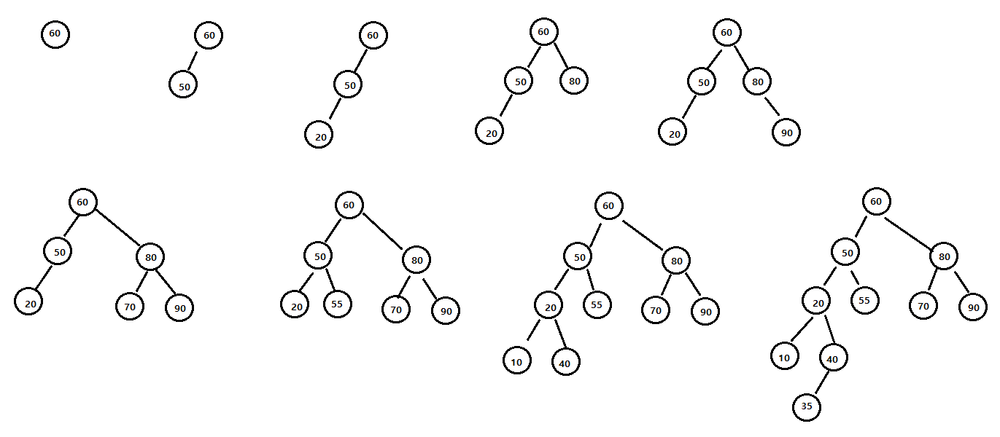
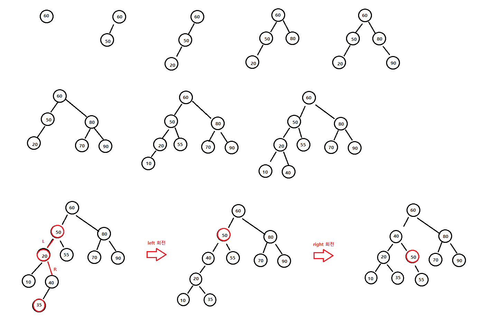
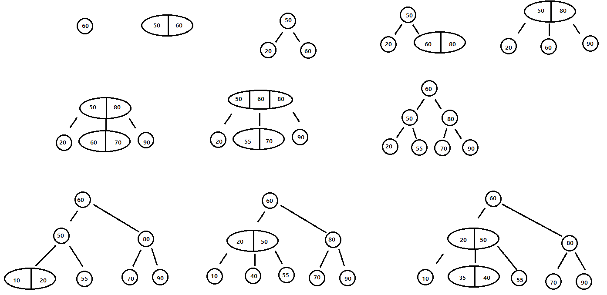
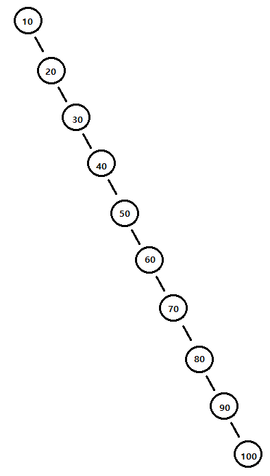
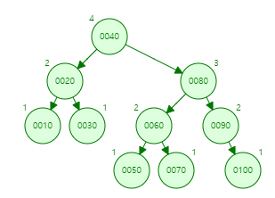
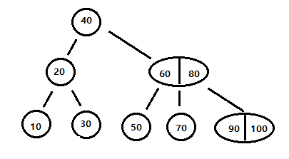
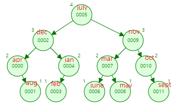

# Chap 13. Search

---------

01.

3


02.

(1) 10회

(2) 3회

(3) 1회


03.

(2)


04.

27번

05.

(1) 이진탐색트리



(2) AVL 트리



(3)




06.

(a) 이진탐색트리



(b) AVL 트리



(c) 2-3 트리



2-3 트리가 탐색을 가장 효율적으로 수행한다.


07.

```c

```


08.

```c

```

09.

