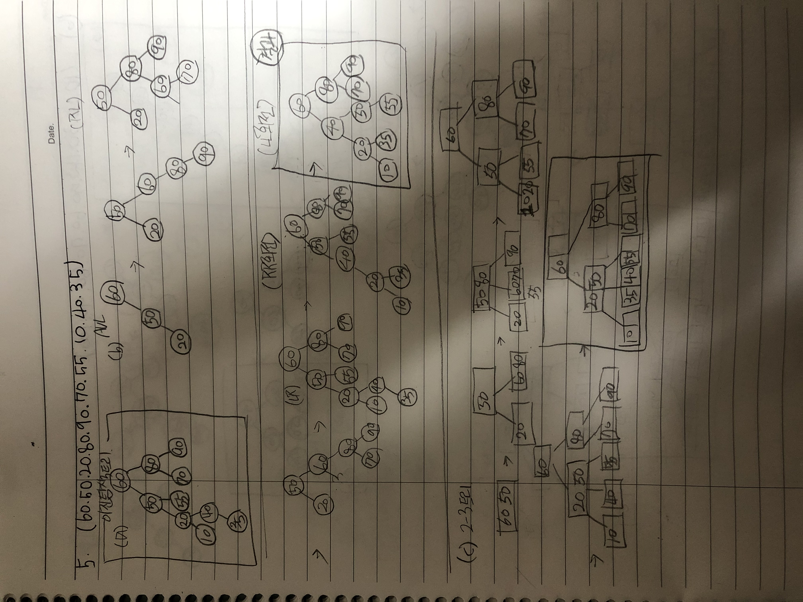
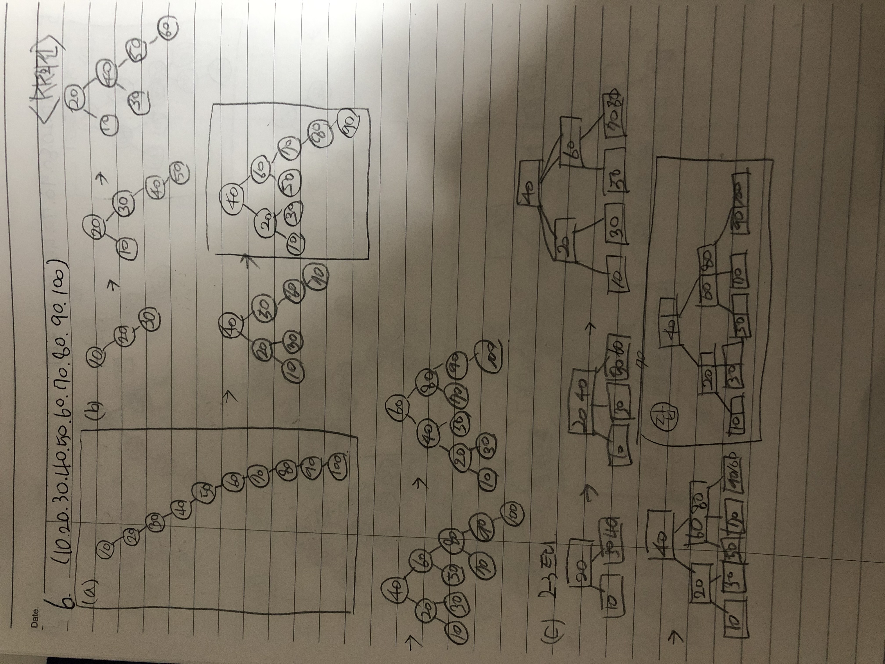
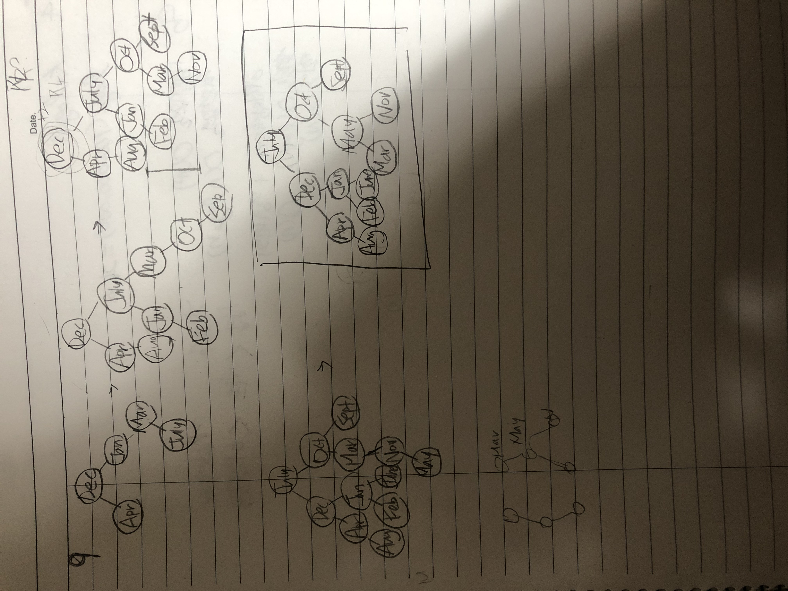

###### 1. 

3번 피보나치 수열에 따라 다음에 비교할 대상을 선정하여 검색한다. 

###### 2.

(1)  10번

(2)  3번

(3)  1번?

###### 3.

(4) 탐색 

삽입을 먼저한다음 탐색을 통해 회전을 하는 순서이다.

###### 4.

log2(100,000,000)=26.58이므로 27회이다.

###### 5.

###### 6.

###### 7.

###### 8.

worse  -------------------> better

삽입정렬->히프정렬->이진탐색

###### 9.

