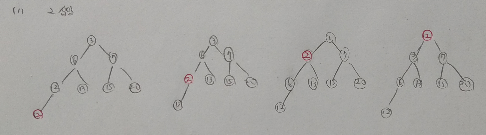
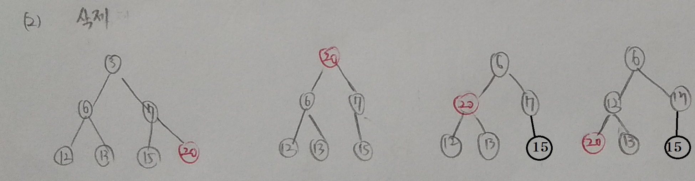
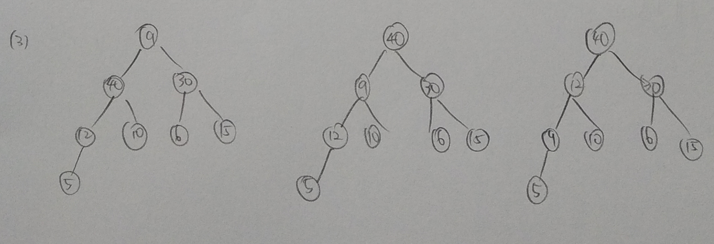
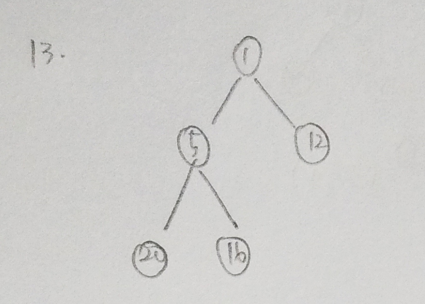
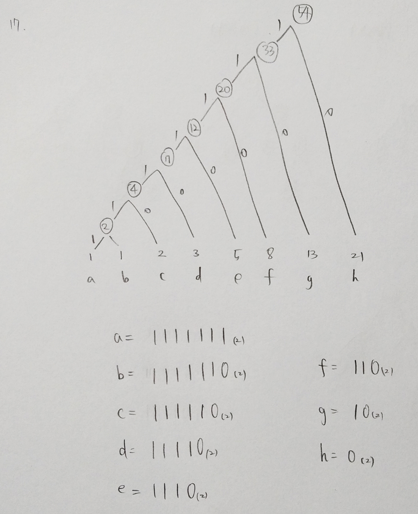

# chapter 9. 우선순위 큐

-----

01.

(1) 루트


02.

(1) 완전 이진 트리이기 때문에 밀집된 배열로 표현할 수 있다.


03.

(2) 트리의 높이. (비례한다고 말하기는 어려울 듯)


04.

(1) 가장 큰 값을 삭제연산하기에 적합하다.


05.

(2) 첫번째 노드


06.

루트의 왼쪽 자식 혹은 오른쪽 자식 노드


07.

높이 4


08.

문제 이상한듯


09.

(1)



(2)




10.

(1)


(2)

| 0    | 1    | 2    | 3    | 4    | 5    | 6    | 7    | 8    | 9    |
| ---- | ---- | ---- | ---- | ---- | ---- | ---- | ---- | ---- | ---- |
|      | 60   | 40   | 30   | 12   | 10   | 6    | 15   | 5    | 9    |

(3)



11.

```c
#include <stdio.h>
#include <stdlib.h>
#include <string.h>
#define MAX_SIZE 100

typedef struct {
	int priority; //우선순위
	char to_do[25]; //할일 내용
} element;

typedef struct {
	element heap[MAX_SIZE];
	int heap_size;
} HeapType;

HeapType* create()
{
	return (HeapType*)malloc(sizeof(HeapType));
}

void init(HeapType* h)
{
	h->heap_size = 0;
}

void insert_max_heap(HeapType* h, element item)
{
	int i;
	i = ++(h->heap_size);
	while ((i != 1) && (item.priority > h->heap[i / 2].priority)) {
		// 트리를 거슬러 올라가면서 부모 노드와 비교
		h->heap[i] = h->heap[i / 2];
		i /= 2;
	}
	h->heap[i] = item; //새로운 노드를 삽입
}

element delete_max_heap(HeapType* h)
{
	int parent, child;
	element item, temp;
	item = h->heap[1];
	temp = h->heap[(h->heap_size)--];
	parent = 1;
	child = 2;
	while (child <= h->heap_size) {
		// 현재 노드의 자식노드 중 더 큰 자식노드를 찾는다
		if ((child < h->heap_size) && (h->heap[child].priority) < h->heap[child + 1].priority)
			child++;
		if (temp.priority >= h->heap[child].priority) break;
		
		h->heap[parent] = h->heap[child];
		parent = child;
		child *= 2;
	}
	h->heap[parent] = temp;
	return item;
}
main()
{
	HeapType* heap;
	heap = create(); //히프 생성
	init(heap); //초기화

	while (1)
	{
		element scan, print;
		printf("삽입(i), 삭제(d) : ");
		char command;
		scanf_s("%c", &command, 1);
		switch (command) {
		case'i':
			printf("할 일 : ");
			char scancont[25];
			scanf_s(" %[^\n]", &scancont, MAX_SIZE);
			strcpy(scan.to_do, scancont);
			printf("우선순위 : ");
			int scankey;
			scanf("%d", &scankey);
			getchar();
			// 엔터를 입력받아서 버퍼에서 제거한다
			scan.priority = scankey;
			insert_max_heap(heap, scan);
			break;
		case'd':
			print = delete_max_heap(heap);
			printf("제일 우선 순위가 높은 일은 \"%s\"\n", print.to_do);
			getchar();
			break;
		default:
			printf("잘못된 명령어 입력\n");
			break;
		}
		printf("\n");
	}
}

```


12.

아니다. 


13.




14.

```C
#include<stdio.h>
#include<stdlib.h>
#define MAX_SIZE 200

typedef struct {
	int heap[MAX_SIZE];
	int heap_size;
}HeapType;

void init(HeapType* h) {
	h->heap_size = 0;
}

int is_empty(HeapType* h) {
	return h->heap_size == 0;
}

int is_full(HeapType* h) {
	return h->heap_size == MAX_SIZE;
}

void insert_max_heap(HeapType* h, int item) {
	if (is_full(h)) {
		printf("max heap이 꽉 찼습니다.");
		exit(1);
	}
	h->heap[(h->heap_size)++] = item;
}

int find_max_heap(HeapType* h) {
	int max;

	if (is_empty(h)) {
		printf("max heap이 비어있습니다.");
		exit(1);
	}
	max = h->heap[0];
	for (int i = 0; i < h->heap_size; i++) {
		if (h->heap[i] > max)
			max = h->heap[i];
	}
	return max;
}

int delete_max_heap(HeapType* h) {
	int max;
	int ind;

	if (is_empty(h)) {
		printf("max heap이 비어있습니다.");
		exit(1);
	}

	max = h->heap[0];
	for (int i = 0; i < h->heap_size; i++) {
		if (h->heap[i] > max) {
			max = h->heap[i];
			ind = i;
		}
	}
	
	for (int i = ind; i < h->heap_size; i++) {
		h->heap[i] = h->heap[i + 1];
	}
	h->heap_size--;

	return max;
}

void print_max_heap(HeapType* h) {
	for (int i = 0; i < h->heap_size; i++) {
		printf("%d ", h->heap[i]);
	}
}

void main() {
	HeapType h;
	init(&h);

	insert_max_heap(&h, 3);
	insert_max_heap(&h, 2);
	insert_max_heap(&h, 1);

	print_max_heap(&h);

}
```

15.

```c
#include <stdio.h>
#include <stdlib.h>

typedef struct LinkedNode {
	int data;
	struct LinkedNode* link;
} LinkedNode;


LinkedNode* insert(LinkedNode* head, int val)
{
	LinkedNode* tmp = (LinkedNode*)malloc(sizeof(LinkedNode));
	LinkedNode* ptr = (LinkedNode*)malloc(sizeof(LinkedNode));
	LinkedNode* pre = (LinkedNode*)malloc(sizeof(LinkedNode));

	tmp->data = val;
	tmp->link = NULL;
	
	if (head == NULL) {
		head = tmp;
		return head;
	}

	if (head->data < val) {
		tmp->link = head;
		head = tmp;
		return head;
	}

	for (ptr = head; ptr->data > val; ptr = ptr->link) {
		if (ptr->link == NULL) {// 끝 노드에서 처리
			if (ptr->data < val) {
				pre->link = tmp;
				tmp->link = ptr;
				return head;
			}
			else {
				ptr->link = tmp;
				return head;
			}
		}
		pre = ptr;
	}
	pre->link = tmp;
	tmp->link = ptr;

	return head;
}

int peek(LinkedNode* head)
{
	return head->data;
}

LinkedNode* pop(LinkedNode* head)
{
	LinkedNode* tmp = head;
	head = head->link;
	free(tmp);
	return head;
}

void print_Llist(LinkedNode* head) {
	LinkedNode* ptr = head;
	if (head == NULL) {
		return;
	}
	for (ptr = head; ptr->link != NULL; ptr = ptr->link) {
		printf("%d ", ptr->data);
	}
}

void main() {
	LinkedNode* h = NULL;
	int num;

	h = insert(h, 6);
	h = insert(h, 2);
	h = insert(h, 3);
	h = insert(h, 4);
	h = insert(h, 5);
	h = insert(h, 7);
	h = insert(h, 1);
	h = insert(h, 3);

	print_Llist(h);
}
```

16.

17.



